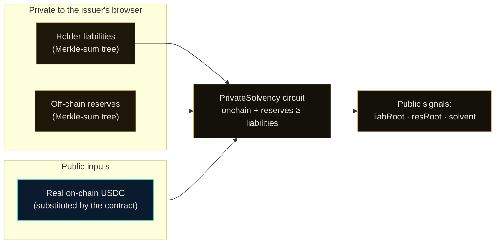
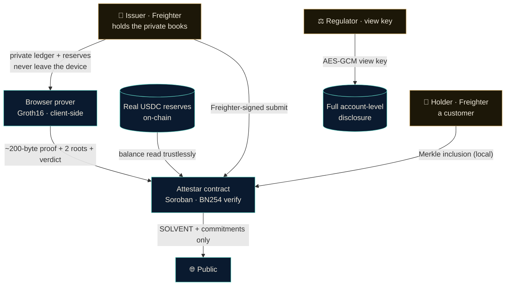
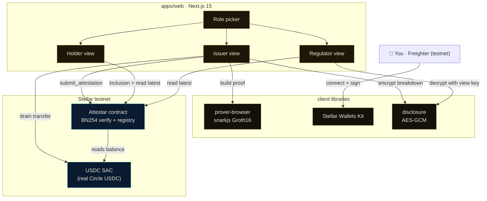
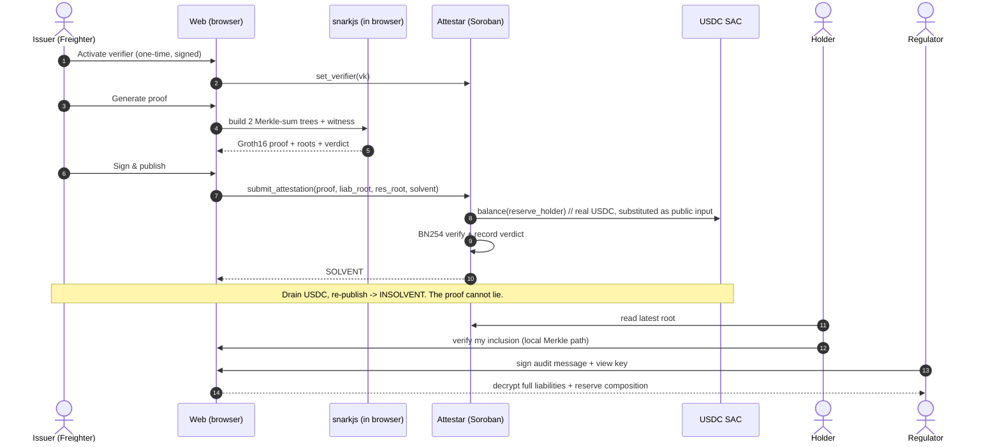

<div align="center">

# Attestar

**Continuous, private proof of solvency for stablecoin and RWA issuers on Stellar.**

An issuer proves on-chain that its reserves cover every holder balance, without revealing a single account, a single custodian, or even the totals. The verdict is a zero-knowledge SNARK verified inside a Soroban smart contract.

[](https://stellar.expert/explorer/testnet/contract/CD36EVFKGZH23JLRQMJZPG7XKPNO6ZVK67GHN2RQJG5VM6CVYTE2GRDH)
[](https://developers.stellar.org/docs/build/apps/zk)
[](https://docs.circom.io/)
[](https://docs.circom.io/)
[](https://stellar.expert/explorer/testnet/contract/CBIELTK6YBZJU5UP2WWQEUCYKLPU6AUNZ2BQ4WWFEIE3USCIHMXQDAMA)

</div>

---

Attestar is proof-of-reserves that a regulator would accept and a competitor cannot read. An issuer keeps its customer ledger and its reserve composition private, generates a Groth16 proof **in the browser** that `on-chain USDC + private off-chain reserves >= liabilities`, and submits it with a **Freighter**-signed transaction. The Soroban contract verifies the proof against Stellar's native **BN254** host functions and substitutes the issuer's **real on-chain USDC balance** as the only public reserve input, so the number cannot be faked. Holders independently verify their own inclusion; a regulator with a view key reconstructs the full breakdown. This is the always-on, cryptographic complement to the monthly accounting attestation that the US **GENIUS Act** and EU **MiCA** now require.

## The problem

Proof-of-reserves today is a PDF. An accounting firm signs a point-in-time attestation once a month, you take it on faith, and nothing is verifiable in between. That model has already failed in public: USDC depegged to $0.87 in March 2023 when 8% of its reserves were trapped at Silicon Valley Bank, Tether has still never completed a Big-Four audit, and in 2026 a regulated exchange kept asserting solvency while its hot wallet drained to nothing. Meanwhile the GENIUS Act and MiCA have turned voluntary attestation into a legal mandate with monthly reserve disclosure and officer certification.

The obvious fix, put reserves and liabilities on-chain, breaks on privacy. A stablecoin or tokenized-fund issuer cannot publish its customer ledger or reveal which banks hold how much of its reserves; that is competitively and legally radioactive. So issuers are stuck between an unverifiable monthly PDF and a transparency they cannot accept.

Zero-knowledge dissolves the tradeoff. Attestar proves the *property* you care about, reserves cover liabilities, every epoch and on-chain, while the underlying figures stay private. Verifiable transparency for the public, full disclosure for the regulator, secrecy from everyone else.

## What it proves

The circuit takes two private vectors and one public number and proves a single inequality in zero knowledge:



- Every balance is **range-checked** (`Num2Bits(64)`), which blocks the classic proof-of-reserves fraud of hiding liabilities behind negative leaves.
- Both totals stay private. Only two Poseidon **root commitments**, the boolean **verdict**, and the issuer's real **on-chain USDC** are public.
- Because the contract supplies the on-chain figure itself, a prover cannot overstate reserves: the four public signals must match the proof exactly or verification fails.

## Three actors, one balance sheet



- **Issuer** edits a private liability ledger and private reserve sources, proves solvency in the browser, and publishes with their wallet. Draining real USDC and re-publishing flips the on-chain verdict to `INSOLVENT`. The issuer cannot publish a `SOLVENT` lie, because the verdict is computed inside the proof against the real on-chain balance.
- **Holder** connects a wallet and verifies a Merkle inclusion path proving their own balance is counted in the proven liabilities, seeing only their own number.
- **Regulator** connects the authorized wallet, signs an audit-access message, and decrypts the issuer's disclosure package to reconstruct every holder balance and every reserve source. Selective disclosure, on demand.

## System architecture



## End-to-end flow



## The honest boundary

Zero-knowledge proves two things trustlessly: the liabilities committed in the tree, and the on-chain reserves the contract reads itself. It cannot prove that an **off-chain bank balance exists**; that figure enters the proof as a value the issuer commits to, attestable by a custodian ed25519 signature (the contract supports this path). Attestar makes everything around the monthly audit continuous and verifiable, and binds the off-chain figure to a signature, but it complements the accounting attestation rather than replacing the auditor. We state this plainly because understanding the boundary is the difference between a real privacy product and an overclaim.

## What is real vs. illustrative

| Piece | Status |
|---|---|
| The ZK circuit, proving, and on-chain BN254 verification | **Real.** 30,284-constraint Groth16 circuit, verified on Stellar testnet. |
| Reserves (on-chain portion) | **Real Circle USDC** on testnet, read trustlessly by the contract. Drain is a real Freighter-signed USDC transfer. |
| Wallet signing | **Real Freighter** for all three roles. |
| Holder liability ledger and off-chain reserve sources | **Illustrative example data**, edited in-browser. In production these are the issuer's real private records. They are *meant* to be private and off-chain; that is the point of the ZK. |
| Off-chain fiat existence | Enters as a committed/attested figure (the honest boundary above). |

## Repository layout

```
attestar/
├─ packages/
│  ├─ circuits/          Circom: PrivateSolvency circuit (two Merkle-sum trees + range checks
│  │                     + in-circuit solvency), trusted-setup + encoding scripts
│  ├─ sdk/               TypeScript: MerkleSumTree, Poseidon, witness builder, Groth16 encoding
│  │                     (kept byte-identical to the circuit)
│  ├─ contracts/         Soroban (Rust): Attestar verifier + attestation registry, 10 tests
│  ├─ attestar-client/   Generated TS bindings for the Attestar contract
│  └─ mock-token-client/ Generated TS bindings for the USDC token (SAC) interface
├─ apps/
│  └─ web/               Next.js 15 app: role picker, issuer/holder/regulator views,
│                        client-side proving, Freighter signing, selective disclosure
└─ docs/                 DESIGN.md (original design notes) + demo script
```

## Tech stack

| Layer | What |
|---|---|
| **ZK circuit** | Circom 2.2, Groth16 over BN254, Poseidon hashing, `snarkjs` trusted setup |
| **Proving** | `snarkjs` running client-side (WASM) in the browser; balances never leave the device |
| **On-chain verifier** | Soroban (`soroban-sdk` 27), Stellar **BN254 host functions** (Protocol 25 "X-Ray") for MSM + pairing check |
| **Reserve asset** | Real Circle USDC on Stellar testnet via its Stellar Asset Contract |
| **Frontend** | Next.js 15, React 19, Tailwind v4 |
| **Wallet** | Stellar Wallets Kit (Freighter), SEP-43 signing |
| **Selective disclosure** | WebCrypto AES-GCM under a regulator view key |

## Deployed on Stellar testnet

| Contract | Address |
|---|---|
| **Attestar** (this project) | [`CD36EVFKGZH23JLRQMJZPG7XKPNO6ZVK67GHN2RQJG5VM6CVYTE2GRDH`](https://stellar.expert/explorer/testnet/contract/CD36EVFKGZH23JLRQMJZPG7XKPNO6ZVK67GHN2RQJG5VM6CVYTE2GRDH) |
| USDC (reserve asset, SAC) | [`CBIELTK6YBZJU5UP2WWQEUCYKLPU6AUNZ2BQ4WWFEIE3USCIHMXQDAMA`](https://stellar.expert/explorer/testnet/contract/CBIELTK6YBZJU5UP2WWQEUCYKLPU6AUNZ2BQ4WWFEIE3USCIHMXQDAMA) |
| Circle USDC issuer (testnet) | `GBBD47IF6LWK7P7MDEVSCWR7DPUWV3NY3DTQEVFL4NAT4AQH3ZLLFLA5` |

The Attestar contract surface: `initialize`, `set_verifier`, `submit_attestation`, `get_attestation`, `latest`, `is_solvent`, `verify_proof`.

## Getting started

**Prerequisites:** Node 20+, pnpm 10 (`corepack enable && corepack prepare pnpm@10.10.0 --activate`), and for rebuilding the ZK + contract: Rust, the `stellar` CLI, and `circom` 2.2 (on Windows these run in WSL). A **Freighter** wallet on **testnet** with a USDC trustline and a little testnet USDC (from [faucet.circle.com](https://faucet.circle.com)).

Run the web app against the live testnet deployment:

```bash
pnpm install
pnpm --filter @attestar/sdk build
pnpm --filter attestar-client --filter mock-token-client build
pnpm web:dev        # http://localhost:3100
```

`apps/web/.env.local` is preconfigured with the deployed contract IDs above. Connect Freighter, then: **Activate verifier** (one-time), **Generate proof**, **Sign & publish** (SOLVENT), **Drain USDC**, re-publish (INSOLVENT). Switch roles from the header to verify inclusion as a holder and unlock disclosure as a regulator.

Rebuild the ZK core and redeploy from scratch (WSL):

```bash
# 1. circuit: compile + Groth16 trusted setup (depth 4 liabilities / depth 3 reserves)
cd packages/circuits
bash scripts/ptau.sh 16
bash scripts/build.sh psolvency_demo
node scripts/encode_vk.mjs psolvency_demo        # -> arg_vk.json (for the contract / web)
node scripts/encode_p.mjs                         # -> Rust test fixtures (real proofs)

# 2. contract: build + test against the real BN254 host crypto
cd ../contracts && stellar contract build && cargo test -p attestar

# 3. deploy + initialize with the real USDC SAC as reserve_token, admin = your Freighter address,
#    then point apps/web/.env.local at the new contract id and copy the proving assets into
#    apps/web/public/circuit (psolvency_demo.wasm + .zkey) and apps/web/lib/vk.json.
```

See [`docs/DESIGN.md`](docs/DESIGN.md) for the original design notes and the research that validated the idea.

## License

MIT

---

<div align="center">
<sub>Attestar · solvency you can verify, not just trust. Built for Stellar Hacks: Real-World ZK.</sub>
</div>
